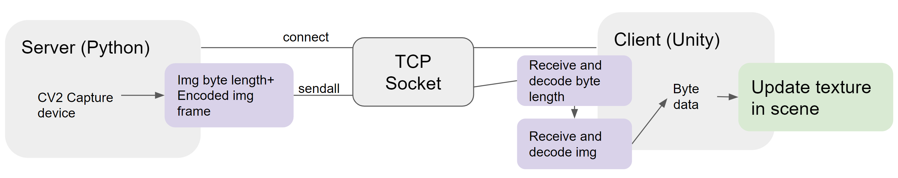

# What and Why?
Prototype for streaming ROS images to Unity textures

This project streams images from a python script that streams image frames from a cv2 camera. There are a lot of ways to access a video/camera stream in ROS and so this project focuses on a prototype that can be customized to suit your needs based on a custom frame streaming protocol.

Current Architecture:

Goal Architecture:

# Setup Instructions

## Test Setup (python client)

1. Run the python server `webcam_video_img_streamer.py`
2. Run the python client `webcam_video_img_streamer.py`

Now two cv2 windows should appear. One is opened by the streamer, one by the client.

## Full Setup (unity client)

1. Save the scripts in `unity_scripts` in the same folder in your Unity project
2. Apply the component `tcp_texture_img_stream.cs` to a gameobject (e.g., via drag-and-drop)
3. Run the python server `webcam_video_img_streamer.py`
4. `Play` the unity project

Now the camera feed should appear on the gameobjects in the scene.

# Next steps
* Create a ROS node
* Improve stability (especially when client unexpectedly disconnects)
* Find better way to avoid "latency buildup"

# Helpful Resources / Sources

## Python:
* background on sockets, lots ideas for optimizations https://docs.python.org/3/howto/sockets.html
* example code for python socket https://medium.com/nerd-for-tech/developing-a-live-video-streaming-application-using-socket-programming-with-python-6bc24e522f19 
* example code for python socket https://github.com/AmimaShifa/Live-Video-Streaming-Application/blob/main/Client.py.ipynb

## Unity
* image over tcp project https://stackoverflow.com/questions/42717713/unity-live-video-streaming

